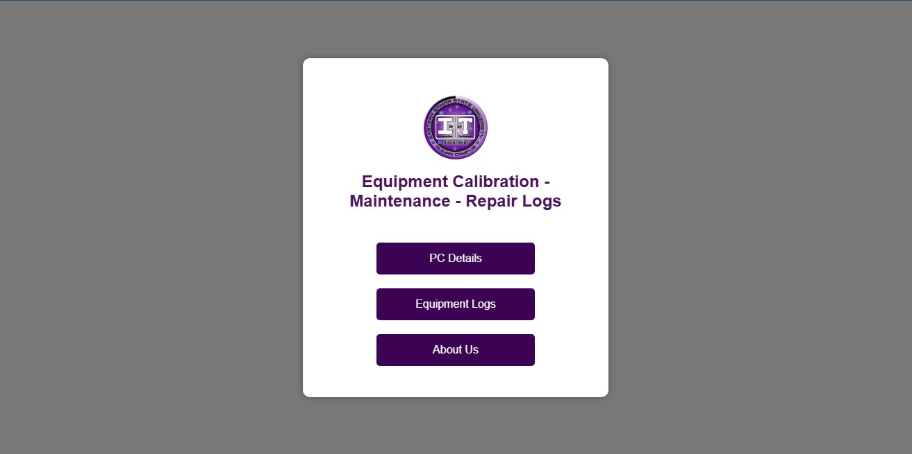
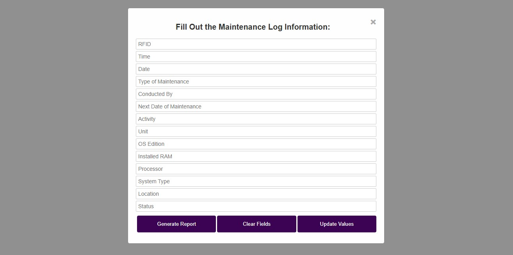
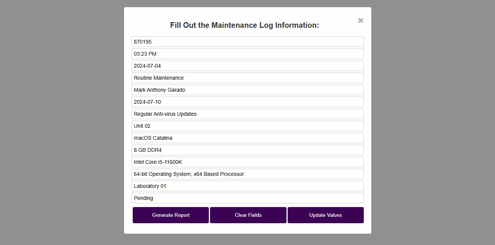
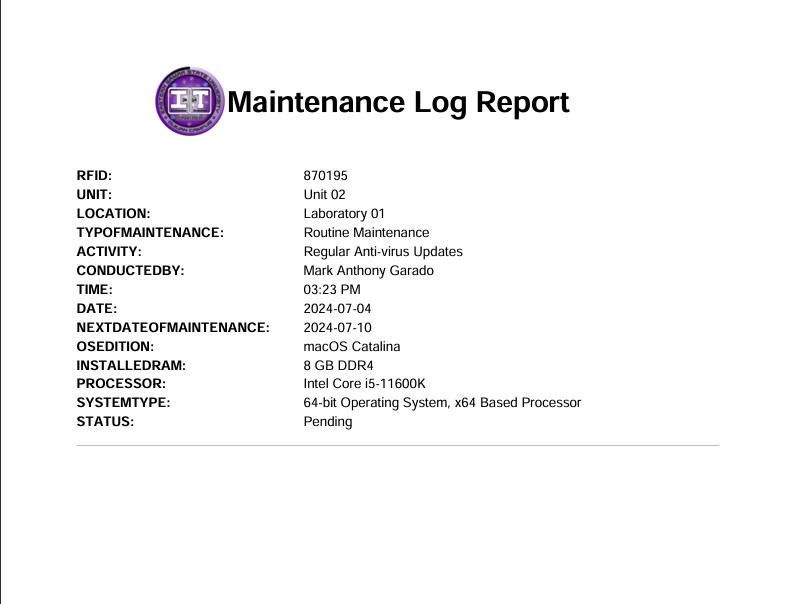

# 🔐 RFID Laboratory Maintenance System  

<p align="center">
  
  
  
  
  
</p>

<p align="center">
  This project was developed as part of my <b>2nd Year Information Technology</b> course requirement for the Department of College of Computer Studies.<br><br>
  It is a web-based system for managing <b>Computer Equipment Calibration, Maintenance, and Repair Logs</b><br>
  using <b>RFID cards</b>, integrated with <b>Google Sheets & Google Apps Script</b> as the backend database.<br><br>
  By leveraging RFID technology, this system reduces manual data entry and minimizes errors — providing a more 
  efficient and automated way to record, update, and monitor equipment maintenance activities.
</p>

## 📥 Clone this Repository  

To clone and run this project locally:  

```bash
git clone https://github.com/codewmarx/rfid-maintenance-tracker.git
cd rfid-maintenance-tracker
```
## 📸 Preview

  
*- On Homepage, please click the "Equipment Logs"*

  
*- Under Equipement Logs, choose "Maintenance Logs" and the form will appear*

  
*- Manually enter RFID code, example: **870195***

  
*- Click outside the input field - data are fetched automatically from **Google Sheets***

  
*- Generate report based on the fetched data and/or updated values*


## 🚀 Features  
- 📡 RFID-based data fetching from Google Sheets  
- 🛠️ **Maintenance Log** (working demo)  
- ⚡ Auto-populates form fields when scanning or manually entering RFID  
- 📝 Options: **Generate Report**, **Clear Values**, **Update Values**  
- 📱 Simple & responsive UI with navigation  

## 🛠️ Setup Instructions  

### Requirements  
- Google Account (for Google Sheets + Apps Script)  
- [XAMPP](https://www.apachefriends.org/) *(if you run it locally)* / Firebase Hosting

### Google Sheets Setup  
1. Create a new **Google Sheet** (e.g., `Equipment Calibration/Maintenance/Repair Log`).  
2. Add a worksheet named **Maintenance** with columns such as:  
   - RFID  
   - TIME  
   - CONDUCTED BY  
   - TYPE OF MAINTENANCE  
   - DATE
   - NEXT DATE OF MAINTENANCE  
   - ACTIVITY
   - UNIT
   - OS EDITION
   - INSTALLED RAM
   - PROCESSOR
   - SYSTEM TYPE
   - LOCATION
   - STATUS

3. Go to **Extensions → App Script**.  
4. Copy the contents of `code.gs` and `test.gs` from this repository under the /scripts folder into your project.  
5. Deploy as a **Web App** → set access to *“Anyone with the link”*.  

## 🖥️ Demo Walkthrough  

1. Open the **[Live Demo](https://marko-738c2.firebaseapp.com/)**.  
2. On the homepage, you’ll see:  
   - **PC Details**  
   - **Equipment Logs (choose this)**  
   - **About**  
3. Inside Equipment Logs:  
   - Calibration Log 
   - **Maintenance Log (choose this)**  
   - Repair Log
   - Home  
4. Select **Maintenance Log** → the form will appear.  
5. Enter one of the sample RFID numbers:  
   - 870195
   - 908511
   - 846433
   - 838363
   - 892099

6. Click outside the input field → the system fetches data from Google Sheets.  
7. Available actions:  
   - **Generate Report**  
   - **Clear Values**  
   - **Update Values**  

## 👨‍💻 Author  

**Developed by:** Mark Anthony Garado  
📌 *For academic purposes only – 2nd Year IT project*  
